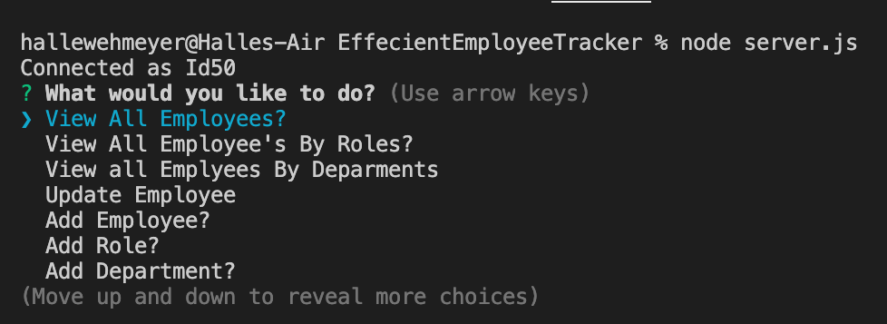
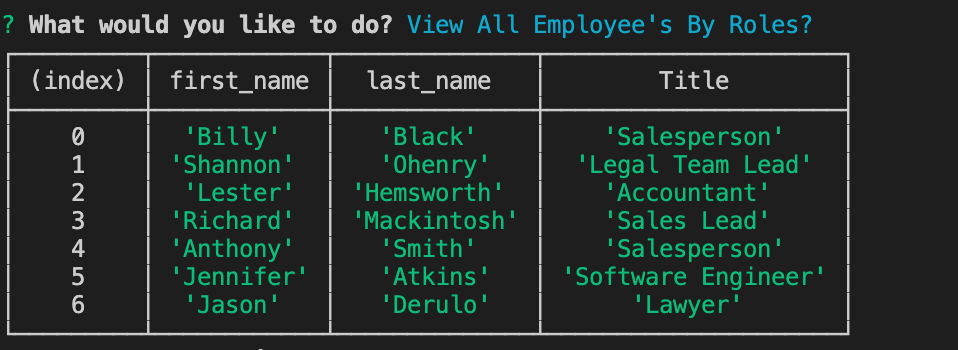
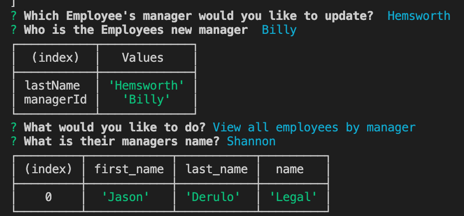

# Effecient Employee Tracker
  

  ### $ Table of Contents
  ### Description
    -An easy-to-use MySQL based CLI app that allows employees to architect and build a solution for managing a company's employees using node and inquirer.
  ### Installation
    -node server.js
  #### Usage
    -After the user successfully runs npm install, they would then type node server.js. The user will then be prompted to the main menu, where they will select 1 of 10 menu options.
    VIDEO TUTORIAL: 
  #### Test
    -There is no testing necessary for this app, user only needs to follow instructions listed under "Usage" 
  ## Example Images
    
    
    
  ### Questions?
  -If you have any questions, you can reach me here:
  -GitHub: <https://github.com/https://github.com/hallewehmeyer>
  -Email: <a href="mailto:halle.atx@gmail.com" target="_blank">halle.atx@gmail.com</a>
  
